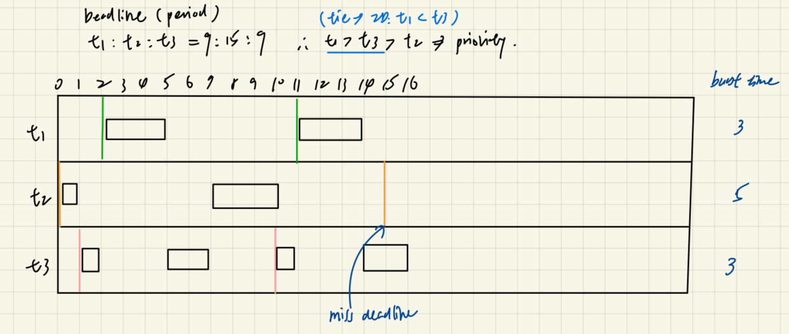

# Files used

We're asked to only modify the file `thread_sched.c`, which is under `MP3/mp3/xv6/user`, but the files `threads.c`, `list.h` should also be checked in order to know the threading library and other information.

# Structure definition

## threads_sched_args

In `mp3/xv6/user/threads_sched.h`, we can find the definition of the structure `threads_sched_args`:

```C
struct threads_sched_args {
    // the number of ticks since threading starts
    int current_time;
    // the time quantum for each thread (for round-robin scheduling)
    int time_quantum;
    // the linked list containing all the threads available to be run
    struct list_head *run_queue;
    // the linked list containing all the threads that will be available later
    struct list_head *release_queue;
};
```

The only queues that will be used are `run_queue` and `release_queue`, where:
- `run_queue`: contains threads that we should choose one thread from to execute
- `release_queue`: contains periodic threads that would be released in the future

## threads_sched_result

In `mp3/xv6/user/threads_sched.h`, we can find the definition of the structure `threads_sched_result`:

```C
struct threads_sched_result {
    // `scheduled_thread_list_member` should point to the `thread_list` member of
    // the scheduled `struct thread` entry
    struct list_head *scheduled_thread_list_member;
    // the number of ticks allocated for this thread to run
    int allocated_time; 
};
```

# Code implementation

## HRRN

### Background assumptions
Implemented in the function: `THREAD_SCHEDULER_HRRN`

From the "4.1.3 test case specifications" in `MP3/MP3-4.pdf`, and the "parameter" section in `MP3/mp3.pptx.pdf`, we could see that when implementing this function, we're assuming that:

- $0 < \text{burst time} \leq 64$
- period $= -1$
> This means cycle interval $= -1$, and implies that the threads are not executing periodically
- $n = 1$
> RT (real-time) cycles count $= 1$
- $0 \leq \text{arrival time} \leq 100$

### Idea

1. For each thread in run queue, calculate the response ratio, which is:
> Get run queue by `args.run_queue`

$$
\text{Response ratio} = \frac{\text{Waiting time + Burst time}}{\text{Burst time}} 
$$
> - waiting time = `args.current_time` - `t->arrival_time`
> - burst time = `t->processing_time`

Note: We got the hint that we should replace division by multiplication to avoid floating point operations.
> This is because in kernel code, floating point is often disallowed because not all embedded system have FPUs.

So in my implementation:

:white_check_mark: I **multiplied the response ratio by a scalar (set to 1000)**, so the code of calculating response ratio would be:

```C
int current_scaled_ratio = (waiting_time + burst_time) * SCALE / burst_time;
```

where we defined `const int SCALE = 1000;` in some previous line.

:warning: Also note that we should **use `int` instead of `float` or `double`** since xv6 does not support them.

2. Choose the next process with the <ins>greatest ratio</ins>

3. If tie on responsed ratio $\rightarrow$ choose <ins>smallest ID</ins>
> Get ID from `t->ID`

### Details

In the function `schedule_hrrn(struct threads_sched_args args)`, we're passed in `args`, which has the structure as follows:

```C
struct threads_sched_args {
    // the number of ticks since threading starts
    int current_time;
    // the time quantum for each thread (for round-robin scheduling)
    int time_quantum;
    // the linked list containing all the threads available to be run
    struct list_head *run_queue;
    // the linked list containing all the threads that will be available later
    struct list_head *release_queue;
};
```

Therefore, we can use `args.run_queue` to access the list of all threads available to run, to further choose the one to run.

So first, we iterate through `args.run_queue` by using the function `list_for_each_entry()`, which is defined in `user/list.h` as follows:

```C
/**
 * list_for_each_entry	-	iterate over list of given type
 * @pos:	the type * to use as a loop counter.
 * @head:	the head for your list.
 * @member:	the name of the list_struct within the struct.
 */
#define list_for_each_entry(pos, head, member)                 \
    for (pos = list_entry((head)->next, typeof(*pos), member); \
         &pos->member != (head);                               \
         pos = list_entry(pos->member.next, typeof(*pos), member))
```

Therefore, in our implementation, we use:

```C
list_for_each_entry(t, args.run_queue, thread_list) 
```

This means that when we iterate through `args.run_queue`, the loop variable is `t`, and we use `thread_list` as the member parameter because as we could see in `threads.h`, each thread is defined as follows:

```C
struct thread {
    void (*fp)(void *arg);
    void *arg;
    void *stack;
    void *stack_p;
    int buf_set;
    struct list_head thread_list;
    ...
}
```

If we further check `list.h`, we can find that `list_head` has the following definition:

```C
#define LIST_HEAD(name) \
    struct list_head name = LIST_HEAD_INIT(name)

#define INIT_LIST_HEAD(ptr)  \
    do                       \
    {                        \
        (ptr)->next = (ptr); \
        (ptr)->prev = (ptr); \
    } while (0)
```

So each `thread_list` of structure `list_head` would contain pointer to its next and previous thread, so that we can therefore iterate.

Internally, in the function `list_for_each_entry()`, we starts iterating from the node `args.run_queue->next`, but this node is not of type `struct thread*` but `list_head*`, so in order to get the `struct thread*` it actually represents, the function `list_entry()` in `list_for_each_entry()` would get and return a thread to `pos`.


## PRIORITY_RR

### Idea

1. Scan through `run_queue` and keep track of the <ins>minimum priority value</ins> (smaller value indicates higher priority)

## DM

### Implementation
#### Handle sleeping until next thread is released

When we did not find a thread to execute, then we should first determine if there would be a thread released in the future.

:x: We cannot just do so as the following:

```C
if (!selected) {
        r.scheduled_thread_list_member = NULL;
        r.allocated_time = 0;
        return r;
    }
```

:white_check_mark: But should use the approach below:


```C
if (selected == NULL) {
        int next_release = INT_MAX;
        struct release_queue_entry *rqe = NULL;
        list_for_each_entry(rqe, args.release_queue, thread_list) {
            if (rqe->release_time > args.current_time && rqe->release_time < next_release) {
                next_release = rqe->release_time;
            }
        }
        
        if (next_release != INT_MAX) {
            // Sleep until next release
            r.scheduled_thread_list_member = args.run_queue;
            r.allocated_time = next_release - args.current_time;
        } else {
            // No future releases
            r.scheduled_thread_list_member = NULL;
            r.allocated_time = 0;
        }
        return r;
    }
```

If we did not find any selected thread, we:
1. Set the time that we want to sleep as `next_release`
2. Loop through the release queue, and update `next_release` if there's a thread that would be released in the future, and its release time is earlier than the current thread that is earliest released
3.
- If we really found a thread that would be released in the future, set the corresponding settings (which would be explained later)
> We have updated `next_release`, so `if (next_release != INT_MAX)` holds
- If there's no thread to be released in the future, meaning that all threads are finished, set the lines in the else block, this would quit the whole execution.

We use the following lines to indicate sleeping until the next release:

```C
// Sleep until next release
r.scheduled_thread_list_member = args.run_queue;
r.allocated_time = next_release - args.current_time;
```

Because as we could see in `threads.c`, the `thread_start_threading()` function first set:

```C
current = &run_queue;
```

Then in the `schedule()` function, we set `r = schedule_dm(args);` (suppose it's the DM case), and then we have:

```C
current = r.scheduled_thread_list_member;   // we set as args.run_queue
allocated_time = r.allocated_time;          // we set as next_release - args.current_time;
```

Thus, when we got back to `thread_start_threading()`, and called the `dispatch()` function, we would return directly to `thread_start_threading()` due to the following lines in `dispatch()`:

```C
if (current == &run_queue) {
    return;
}
```

Then since release queue is not empty, we would print the last line in the following code and sleep:

```C
if (list_empty(&run_queue) && list_empty(&release_queue)) {
    break;
}

// no thread in run_queue, release_queue not empty
printf("run_queue is empty, sleep for %d ticks\n", allocated_time);
```

### Debug

We can check the content of the tested public cases `user/rrtask*.c`, where `*` can be replaced by 1-5.

For example, after running the testing commmand `python3 grade-mp3-DM.py`, if FAILED, we can check the file `MP3/mp3/xv6/xv6.out.uthread` to see the output result.

Note that if multiple public cases fail, only the last output (output of `user/rrtask5.c`) would be saved in this file.

#### Ex: rrtask5

From the main function in `rrtask5.c`, since we're testing the DM algorithm, the else if part at line 32 would be executed.

We can see that three `thread_create()` is executed:


```C
struct thread *t1 = thread_create(f, NULL, 1, 3, 9, 2);
struct thread *t2 = thread_create(f, NULL, 1, 5, 15, 2);
struct thread *t3 = thread_create(f, NULL, 1, 3, 9, 2);
```

Going back to check the definition of `thread_create()`in `threads.c`:

```C
struct thread *thread_create(void (*f)(void *), void *arg, int is_real_time, int processing_time, int period, int n)
```

We can see that the four integer values in the parameters are:

1. `is_real_time` (1 = RT; 0 = non_RT)
2. `processing_time` (burst time per cycle)
3. `period` (cycle interval)
4. `n` (real time cycles count)
> - `n` means that n instances of this thread would be executed
> For example: 
> `*t1 = thread_create(f, NULL, 1, 3, 9, 2);` means that t1 is a real-time thread, which has burst time 3, t1 would be dispatched every 9 ticks, and in our test case, two t1 would be dispatched

Now we can move on considering the whole content in this case:

```C
} else if (strcmp(argv[1], "DM") == 0) {
        struct thread *t1 = thread_create(f, NULL, 1, 3, 9, 2);
        thread_add_at(t1, 2);

        struct thread *t2 = thread_create(f, NULL, 1, 5, 15, 2);
        thread_add_at(t2, 0);

        struct thread *t3 = thread_create(f, NULL, 1, 3, 9, 2);
        thread_add_at(t3, 1);
        }
```

Taking a look at the function `thread_add_at()` in `threads.c`:

```C
void thread_add_at(struct thread *t, int arrival_time)
```

We can see that for example:

```C
thread_add_at(t1, 2);
```

means that t1 is first arrived at t = 2.

In this test case, the deadline for t1, t2, t3 are the period values 9, 15, 9, so the priority is t1 > t3 > t2 (since ID is used to breack the tie, so t1 > t3)




## EDF with CBS

### Definition

#### soft task

Check: remaining execution time violate bandwidth constraint? 

$\rightarrow$

$$
\frac{\text{Remaining CBS Budget Time}}{\text{Time until CBS Deadline}} > \frac{\text{CBS Budget Time}}{\text{Period}}
$$

If holds:
- given new CBS deadline (Current time + Period)
- fill budget up again

###  Workflow


### Given instructions 

In the comments of the given code structure, we're told to:

```C
// notify the throttle task
// TO DO

// first check if there is any thread has missed its current deadline
// TO DO

// handle the case where run queue is empty
// TO DO
```

<!-- - The first TODO is done in 1. in the code
- The next TODO is done in 2. in the code
- The last TODO is done in 4. in the code 
> Because we need to first loop through the run queue in 3. to find the selected thread. -->

:warning: <ins>The following things are not stated in the spec, but is told by the TAs in the discussion section on NTUCool</ins>:

- We should reselect the thread to execute after a thread has been replenished
> Considering the case that when a soft real-time thread is selected, and it is throttled, after replenishment, its deadline might be later than other threads, so we need to reselect and find the earliest deadline, and if the newly selected thread is still soft, we need to recheck if it should be replenished again.
- Even when there's only one thread in the system, when this thread has used up its budget and being throttled, we should let the system to be idle 
> According to CBS regulations, we should only replenish when current time meet the thread's current deadline.
- We do not need to consider budget for hard real-time threads
- If we knew that a hard real-time thread could not be finished at its deadline, we shold allocate time until its deadline instead of not letting it to execute.

### Implementation


### Fallible implementations

We cannot check if a thread in the runqueue has missed its deadline by the following function `__check_deadline_miss` (which is also in `threads_sched.c`):

```C
#if defined(THREAD_SCHEDULER_EDF_CBS) || defined(THREAD_SCHEDULER_DM)
static struct thread *__check_deadline_miss(struct list_head *run_queue, int current_time)
{
    struct thread *th = NULL;
    struct thread *thread_missing_deadline = NULL;
    list_for_each_entry(th, run_queue, thread_list) {
        if (th->current_deadline <= current_time) {
            if (thread_missing_deadline == NULL)
                thread_missing_deadline = th;
            else if (th->ID < thread_missing_deadline->ID)
                thread_missing_deadline = th;
        }
    }
    return thread_missing_deadline;
}
#endif
```

:x: Since if multiple threads have missed their deadline, only the thread with the smallest ID would be returned.
