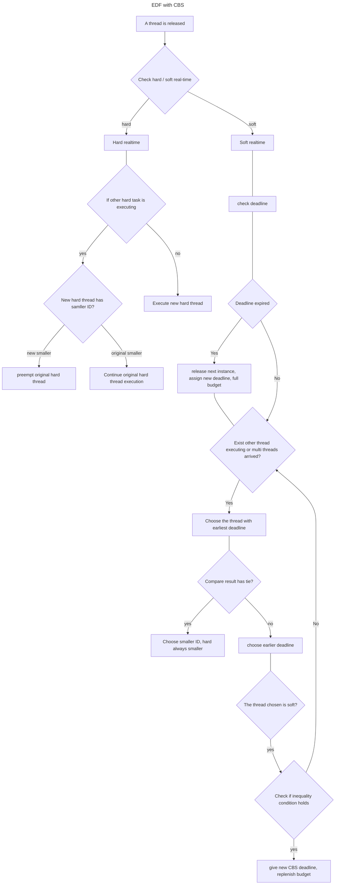

```mermaid
---
title: EDF with CBS
---
flowchart TD
    start[A thread is released]
    check_type{Check hard / soft real-time}
    hard[Hard realtime]
    soft[Soft realtime]

    start --> check_type
    check_type -->|hard|hard
    check_type -->|soft|soft

    %% HARD
    check_other_hard{If other hard task is executing}
    has_hard{New hard thread has samller ID?}
    exec_new_hard[Execute new hard thread]
    new_hard_smaller[preempt original hard thread]
    old_hard_smaller[Continue original hard thread execution]
    
    hard --- check_other_hard
    check_other_hard --> |yes|has_hard
    has_hard --> |new smaller|new_hard_smaller
    has_hard --> |original smaller|old_hard_smaller
    check_other_hard --> |no|exec_new_hard


    %% soft
    check_DL[check deadline]
    DL_expired{Deadline expired}
    release[release next instance, assign new deadline, full budget]
    mult_single{Exist other thread executing or multi threads arrived?}
    select[Choose the thread with earliest deadline]
    tie{Compare result has tie?}
    has_tie[Choose smaller ID, hard always smaller]
    no_tie[choose earlier deadline]
    choose_SH{The thread chosen is soft?}
    inequality{Check if inequality condition holds}
    cond_hold[give new CBS deadline, replenish budget]
    
    %% DL EXPIRED
    DL_expired -->|Yes|release
    release --- mult_single

    %% DL NOT EXPIRED
    soft --- check_DL 
    check_DL --- DL_expired
    DL_expired -->|No| mult_single

    %% multiple threads at the same time
    mult_single -->|Yes|select
    select --- tie
    tie --> |yes|has_tie
    tie --> |no|no_tie
    no_tie --- choose_SH
    choose_SH -->|yes|inequality
    
    %% only one thread at this tick
    inequality -->|No| mult_single
    inequality -->|yes| cond_hold


```