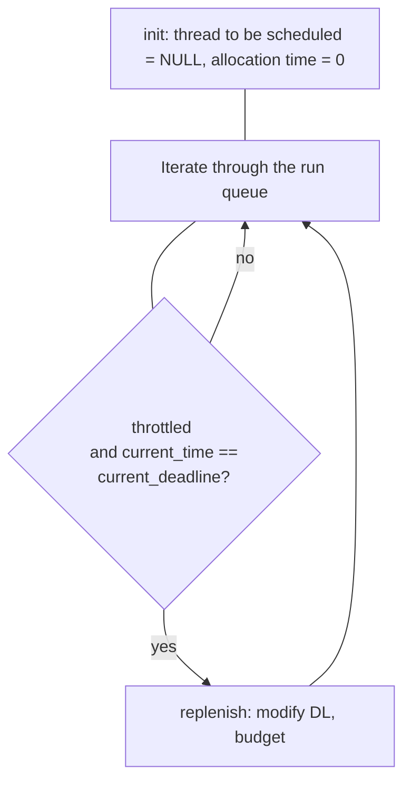

```mermaid
---
EDF implementation flow
---
flowchart TD

init["init: thread to be scheduled = NULL, allocation time = 0"]
iter_run[Iterate through the run queue]
missed{throttled <br> and current_time == current_deadline?}
has_miss[replenish: modify DL, budget]


init --- iter_run
iter_run --- missed
missed -->|yes|has_miss
missed -->|no|iter_run
has_miss --> iter_run

```