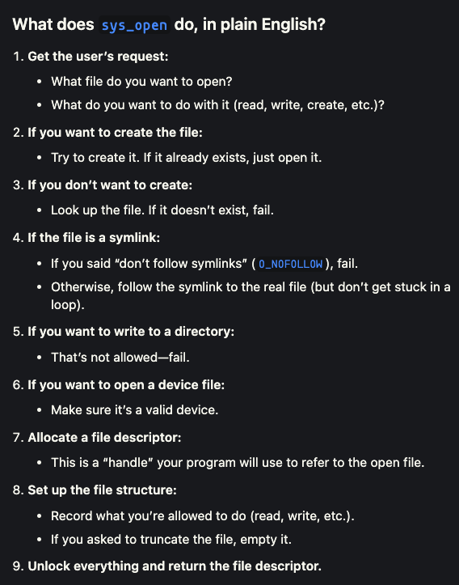

# TODO

- Finish implementation of the `chmod` function in `user/chmod.c`
- Check if the mode setting is correct, need to recheck the second and third part in 3.4. Guidance

# sys_symlink

In `kernel/sysfile.c`

## Functions used

In `sys_symlink()`, we uses the following functions:

### argstr

```C
// Fetch the nth word-sized system call argument as a null-terminated string.
// Copies into buf, at most max.
// Returns string length if OK (including nul), -1 if error.
int argstr(int n, char *buf, int max)
{
    uint64 addr;
    if (argaddr(n, &addr) < 0)
        return -1;
    return fetchstr(addr, buf, max);
}
```
> In `kernel/syscall.c`

- `n`: The index of the argument to fetch (0 for first arg, 1 for second, etc.)

### begin_op / end_op

The following functions `begin_op()` and `end_op()` can be found in `kernel/log.c`

We use these functions to mark the beginning and the end of a file system system call
$\rightarrow$ to ensure atomic

```C
// called at the start of each FS system call.
void begin_op(void)
{
    acquire(&log.lock);
    while (1)
    {
        if (log.committing)
        {
            sleep(&log, &log.lock);
        }
        else if (log.lh.n + (log.outstanding + 1) * MAXOPBLOCKS > LOGSIZE)
        {
            // this op might exhaust log space; wait for commit.
            sleep(&log, &log.lock);
        }
        else
        {
            log.outstanding += 1;
            release(&log.lock);
            break;
        }
    }
}
```

```C
// called at the end of each FS system call.
// commits if this was the last outstanding operation.
void end_op(void)
{
    int do_commit = 0;

    acquire(&log.lock);
    log.outstanding -= 1;
    if (log.committing)
        panic("log.committing");
    if (log.outstanding == 0)
    {
        do_commit = 1;
        log.committing = 1;
    }
    else
    {
        // begin_op() may be waiting for log space,
        // and decrementing log.outstanding has decreased
        // the amount of reserved space.
        wakeup(&log);
    }
    release(&log.lock);

    if (do_commit)
    {
        // call commit w/o holding locks, since not allowed
        // to sleep with locks.
        commit();
        acquire(&log.lock);
        log.committing = 0;
        wakeup(&log);
        release(&log.lock);
    }
}
```

### create

This original code of the function can be found in `kernel/sysfile.c`, for the code below, I added some comments to enhance understanding: 

```C
static struct inode *create(char *path, short type, short major, short minor)
{
    struct inode *ip, *dp;
    char name[DIRSIZ];

    if ((dp = nameiparent(path, name)) == 0)
        return 0;

    ilock(dp);

    // Check if the file already in the directory
    if ((ip = dirlookup(dp, name, 0)) != 0)
    {
        iunlockput(dp);
        ilock(ip);
        // If the file already exists, and we're creating a T_FILE type file, 
        // just return the existing file (ip)
        if (type == T_FILE && (ip->type == T_FILE || ip->type == T_DEVICE))
            return ip;
        iunlockput(ip);
        return 0;
    }

    // if the file does not exist, allocate a new inode (ip)
    if ((ip = ialloc(dp->dev, type)) == 0)
        panic("create: ialloc");

    // lock the inode before modifying its properties
    ilock(ip);
    ip->major = major;
    ip->minor = minor;
    ip->nlink = 1;
    
    /*Added line here*/
    ip->permission = 0x3; // default: rw
    
    iupdate(ip);

    // If we're creating a directory
    if (type == T_DIR)
    {                // Create . and .. entries.
        dp->nlink++; // for ".."
        iupdate(dp);
        // No ip->nlink++ for ".": avoid cyclic ref count.
        if (dirlink(ip, ".", ip->inum) < 0 || dirlink(ip, "..", dp->inum) < 0)
            panic("create dots");
    }

    // Link the new inode to the partent directory
    if (dirlink(dp, name, ip->inum) < 0)    // If linking failed
        panic("create: dirlink");

    iunlockput(dp);

    return ip;
}
```

In this `create()` function, we have two inodes:

1. `ip` **(index pointer)**: This represents the newly created file/symlink/directory, and will be returned by the function

> In our case, `ip` would be representing our newly created symlink

2. `dp` **(directory pointer)**: This is the directory where the new file/symlink will be placed

> For example, if creating `/home/user/mylink`, dp represents `/home/user`

In this function, we add a new file entry into the partent directory, so before we modify the partent directory, we lock it by `ilock(dp);`, then after we're done adding, we unlock the parent directory by `iunlockput(dp);`, and return the newly created inode (symlink).

:bulb: After `create()` returned, we have a <ins>locked inode</ins> `ip`, which represents to our symlink.

#### Modified part

Note that we need to add the following line to the `create()` function:

```C
ip->permission = 0x3; // default: rw
```

Since we're asked to set the default permission to readable and writable.

#### dirlink

The function `dirlink()` is used to link the new inode to its parent directory, and is defined as:

```C
// Write a new directory entry (name, inum) into the directory dp.
int dirlink(struct inode *dp, char *name, uint inum)
{
    int off;
    struct dirent de;
    struct inode *ip;

    // Check that name is not present.
    if ((ip = dirlookup(dp, name, 0)) != 0)     // If the given name is already existed in the directory
    {
        iput(ip);       // release the found inode
        return -1;      // indicte failure since we can't create a duplicate name
    }

    // Look for an empty dirent.
    for (off = 0; off < dp->size; off += sizeof(de))
    {
        if (readi(dp, 0, (uint64)&de, off, sizeof(de)) != sizeof(de))
            panic("dirlink read");
        if (de.inum == 0)
            break;
    }

    strncpy(de.name, name, DIRSIZ);     // copy the name into the directory entry
    de.inum = inum;                     // set the inode number (inum) to the entry
    if (writei(dp, 0, (uint64)&de, off, sizeof(de)) != sizeof(de))
        panic("dirlink");

    return 0;       // indicates a success link
}
```

> In `kernel/fs.c` 

- Note: In the `create()` function, we call `panic()` if `dirlink()` failed, this is because before linking, we've already verified that the file does not exist, allocated a new inode and set up the properties of that inode, so if it still fails to link, the problem might due to a fundamental file system error.


### writei

```C
// Write data to inode.
// Caller must hold ip->lock.
// If user_src==1, then src is a user virtual address;
// otherwise, src is a kernel address.
int writei(struct inode *ip, int user_src, uint64 src, uint off, uint n)
{
    uint tot, m;
    struct buf *bp;

    if (off > ip->size || off + n < off)
        return -1;
    if (off + n > MAXFILE * BSIZE)
        return -1;

    for (tot = 0; tot < n; tot += m, off += m, src += m)
    {
        uint bn = off / BSIZE;
        uint disk_lbn = bmap(ip, bn);
        bp = bread(ip->dev, disk_lbn);
        m = min(n - tot, BSIZE - off % BSIZE);
        if (either_copyin(bp->data + (off % BSIZE), user_src, src, m) == -1)
        {
            brelse(bp);
            break;
        }
        log_write(bp);
        brelse(bp);
    }

    if (n > 0)
    {
        if (off > ip->size)
            ip->size = off;
        // write the i-node back to disk even if the size didn't change
        // because the loop above might have called bmap() and added a new
        // block to ip->addrs[].
        iupdate(ip);
    }

    return n;
}
```
> In `kernel/fs.c`

### iunlock

```C
// Unlock the given inode.
void iunlock(struct inode *ip)
{
    if (ip == 0 || !holdingsleep(&ip->lock) || ip->ref < 1)
        panic("iunlock");

    releasesleep(&ip->lock);
}
```
> In `kernel/fs.c`

### iunlockput

```C
// Common idiom: unlock, then put.
void iunlockput(struct inode *ip)
{
    iunlock(ip);
    iput(ip);
}
```
> In `kernel/fs.c`

The comment describing `iput()` (which can also be found in `kernel/fs.c`) is as follows:

```
// Drop a reference to an in-memory inode.
// If that was the last reference, the inode cache entry can
// be recycled.
// If that was the last reference and the inode has no links
// to it, free the inode (and its content) on disk.
// All calls to iput() must be inside a transaction in
// case it has to free the inode.
```

To be simple, when we created or accessed an inode, the reference count is incremented, and this reference count tracks how many processes are using the inode. The `iput()` function decreases the reference count for an inode, indicating that we're no longer using it.

- If count = 0, and link count also 0 (no directory entry pointing it), the resource for the inode would be freed.

# sys_chmod

For this function, multiple places should be modified, the modified files and the modified functions / structures in it are stated as below:

- `kernel/sysfile.c`
    - `sys_read()`
    - `syswrite()`
    - `sys_fstat()`
    - `sys_chmod()`
    - `sys_open()`
    - `sys_get_disk_lbn()`
- `kernel/fs.h`
    - `struct dinode`
- `kernel/fs.c`
    - `iupdate()`
    - `ilock()`
- `kernel/file.h`
    - `struct inode`
- `kernel/syscall.h`
- `kernel/syscall.c`
- `user/usys.pl`
- `user/user.h`
- `user/chmod.c`

:exclamation: Note that we're asked to manually create a file `user/chmod.c` and modify `Makefile`. 

For the things that are modified in each function / structure, check the following subsections.


## IMPORTANT MODIFICATION
:bangbang: The following contents in the subsections are the original thought of mine, which would cause the following error!


This happens because originally I added a new field to the `inode` and `dinode` structure, and this would change the size, which is not allowed. 

According to the hint in the spec:


we should replace some field in the inode in order to make the size of inode unchanged.

Therefore, my approach is to <ins>modify the `minor` field, so that `minor` preserves its original use only when `type == T_DEVICE`, otherwise, we use `minor` to represent permission.</ins>

As in `kernel/sysfile.c`, we would have:

```C
static struct inode *create(char *path, short type, short major, short minor)
{
    // Set minor appropriately:
    // - For device files: use the provided minor number
    // - For all other types (T_FILE, T_DIR, T_SYMLINK): use minor for permission (rw=0x3)
    if (type == T_DEVICE) {
        ip->minor = minor;  // Keep original minor for devices
    } else {
        ip->minor = 0x3;    // Default permission: rw for all non-device files
    }
}
```

So in the following subsections, you can still check where to modify, but the contents should be replaced by using `minor`.

> Check the corresponding files for actual content!

## Add inode field: permission

- This is also notified in the above `create()` subsection.

We need to add a field `permission`, which is default set to readable and writable when calling `create()`, so you can find this added line in the `create()` function:

```C
ip->permission = 0x3; // default: rw
```

Also, note that since we're adding a new field, we need to add `permission` to both:

1. `struct dinode`

> `dinode` is inode stored on disk, we need it to store things that are needed after reboot / power loss

2. `struct inode`

Since for example, when we load a file, the kernel reads `dinode` from disk and fills in a new `inode` in memory, so when we change a field like `permission`, we update the content of `inode`, and call `iupdate()` to write the changes back to the `dinode` on disk.

:one: Thus, we should first add the field:

```C
struct dinode
{
    /* Add this line*/
    short permission;        // File permission (r=1, w=2, rw=3)
};
```

> In `kernel/fs.h`

```C
// in-memory copy of an inode
struct inode
{
    /* Add this line*/
    short permission;      // File permission (r=1, w=2, rw=3)
};
```

> In `kernel/file.h`


:two: Then we should modify `iupdate()` to write the permission of `inode` to `dinode`:

```C
/* TODO: Access Control & Symbolic Link */
// Copy a modified in-memory inode to disk.
// Must be called after every change to an ip->xxx field
// that lives on disk, since i-node cache is write-through.
// Caller must hold ip->lock.
void iupdate(struct inode *ip)
{
    struct buf *bp;
    struct dinode *dip;
    
    /* Add this line*/
    dip->permission = ip->permission;
}
```

> In `kernel/fs.c`

And similarly to `ilock()`, since the in-memory inode is a cache of the on-disk dinode. When we first access a file, the kernel must ensure that the in-memory copy reflects the current state on disk:

```C
/* TODO: Access Control & Symbolic Link */
// Lock the given inode.
// Reads the inode from disk if necessary.
void ilock(struct inode *ip)
{
    struct buf *bp;
    struct dinode *dip;

    if (ip->valid == 0)
    {
        /* Add this line*/
        ip->permission = dip->permission;
    }
}
```

## Add permission check

For the functions:

1. `sys_read()`
2. `syswrite()`
3. `sys_fstat()`
4. `sys_get_disk_lbn()`

in `kernel/sysfile.c`, we should add permission check before executing them.

### sys_get_disk_lbn

Note that in this function, the modified part is:

```C
if (!(f->ip->permission & 0x1)) // no read permission
    return -1;
```

Note that we need to access the inode of the file, since "permission" is a field of the inode structure, but not in the file descriptor, so `f->permission` would trigger error.

The `file` and `inode` structure are as follows:

```C
struct file {
    enum { FD_NONE, FD_PIPE, FD_INODE, FD_DEVICE } type;
    int ref;
    char readable;
    char writable;
    struct pipe *pipe;
    struct inode *ip;  // <- This points to the inode
    uint off;
    short major;
};

struct inode {
    // ... other fields ...
    short type;
    short major;
    short minor;
    short nlink;
    uint size;
    uint permission;  // <- access permission field we added here
    // ... other fields ...
};
```

Thus, we first access `file->ip`, then use the inode `ip` to get the permission info.

## Uncomment system call number

Originally, the following line in `kernel/syscall.h` is commented out, uncomment it:

```C
/* TODO: Access Control & Symbolic Link */
#define SYS_chmod 28
```

## Add chmod to syscall table

In `kernel/syscall.c`, we need to add the following lines:

```C
/* TODO: Access Control & Symbolic Link */
extern uint64 sys_chmod(void);

static uint64 (*syscalls[])(void) = {
    [SYS_chmod] sys_chmod,
};
```

## Declare chmod in user

We need to declare a user function `chmod` in `user/user.h`, in order to let user programs to call then trigger a trap into the kernel and pass the arguments

```C
/* TODO: Access Control & Symbolic Link */
int chmod(const char *, int);
```

## Add user stub to trigger chmod syscall

Add the following line in `user/usys.pl`:

```C
# TODO: Access Control
entry("chmod");
```
The reason why we need to do so and what a "user stub" is is shown in the image below:


## sys_chmod: modification and explanation 

In the `sys_chmod` function itself, we first fetch the arguments by the line:

```C
// Fetch arguments: path and mode
if (argstr(0, path, MAXPATH) < 0 || argint(1, &mode) < 0)
    return -1;
```

The following image explains why we have this line like this intuitively:


## chmod.c

### printf / fprintf

We use:

```C
fprintf(2, "Usage: chmod [-R] (+|-) (r|w|rw|wr) file_name|dir_name\n");
```

instead of:

```C
printf(2, "Usage: chmod [-R] (+|-) (r|w|rw|wr) file_name|dir_name\n");
```

because of the following reason:


### which chmod

In the last part of `chmod.c`, we have:

```C
if (chmod(argv[2], mode) < 0) {
    fprintf(2, "chmod: cannot chmod %s\n", argv[2]);
    exit(1);
}
```

here's a `chmod()` function in the first line, but our file is also called `chmod.c`, then why would the compiler knew that it is not calling the current file itself?

The following is the detailed explanation:


# sys_open

The following code is the function `sys_open()` in `sysfile.c`, and some comments are added to enhance understanding. But before checking the code, the following images are the intuitive explanation of this function, which I found really useful:





```C
/* TODO: Access Control & Symbolic Link */
uint64 sys_open(void)
{
    char path[MAXPATH];     // the file path to open
    int fd, omode;          // omode: open mode flag (for example: O_NOFOLLOW, O_RDONLY)
    struct file *f;
    struct inode *ip;
    int n;

    if ((n = argstr(0, path, MAXPATH)) < 0 || argint(1, &omode) < 0)
        return -1;

    begin_op();     // start atomic mode

    // If O_CREATE is set
    if (omode & O_CREATE)
    {
        ip = create(path, T_FILE, 0, 0);    // create the file
        if (ip == 0)                        // if creation failed
        {
            end_op();                       // stop atomic operation
            return -1;                  
        }
    }
    else
    {
        // Look up the inode for the path.
        // note: definition of namei shown in the next code snippet below
        if ((ip = namei(path)) == 0)    // If not found
        {
            end_op();
            return -1;
        }
        ilock(ip);                      // lock the inode for safe access

        // Handle symbolic links (follow up to 10 links in a chain)
        int max_links = 10;g
        // If the inode is a symlink and the flag O_NOFOLLOW is not set, follow the link
        while (ip->type == T_SYMLINK && !(omode & O_NOFOLLOW) && max_links-- > 0) {
            char target[MAXPATH];
            // Read the target path from the symlink
            if (readi(ip, 0, (uint64)target, 0, MAXPATH) < 0) {
                iunlockput(ip);
                end_op();
                return -1;
            }
            target[MAXPATH-1] = '\0'; // Ensure null-termination
            
            // Release the current inode and follow the link
            iunlockput(ip);
            
            if ((ip = namei(target)) == 0) {
                end_op();
                return -1;
            }
            ilock(ip);
        }
        
        // Check if we've followed too many links
        if (max_links < 0) {
            iunlockput(ip);
            end_op();
            return -1;
        }

        // Directories are read only
        if (ip->type == T_DIR && omode != O_RDONLY)
        {
            iunlockput(ip);
            end_op();
            return -1;
        }
    }

    if (ip->type == T_DEVICE && (ip->major < 0 || ip->major >= NDEV))
    {
        iunlockput(ip);
        end_op();
        return -1;
    }

    if ((f = filealloc()) == 0 || (fd = fdalloc(f)) < 0)
    {
        if (f)
            fileclose(f);
        iunlockput(ip);
        end_op();
        return -1;
    }

    if (ip->type == T_DEVICE)
    {
        f->type = FD_DEVICE;
        f->major = ip->major;
    }
    else
    {
        f->type = FD_INODE;
        f->off = 0;
    }
    f->ip = ip;
    f->readable = !(omode & O_WRONLY);
    f->writable = (omode & O_WRONLY) || (omode & O_RDWR);

    if ((omode & O_TRUNC) && ip->type == T_FILE)
    {
        itrunc(ip);
    }

    iunlock(ip);
    end_op();

    return fd;
}
```


```C
// Look up and return the inode for a path name.
// If parent != 0, return the inode for the parent and copy the final
// path element into name, which must have room for DIRSIZ bytes.
// Must be called inside a transaction since it calls iput().
static struct inode *namex(char *path, int nameiparent, char *name){

    return ip;
}

struct inode *namei(char *path)
{
    char name[DIRSIZ];
    return namex(path, 0, name);
}
```

> In `kernel/fs.c`

## Add flag

Note that in the `sys_open()` function, some flags are used, but one of them are not defined in the header file `fcntl.h`, where we define the flags.

Manually add the following line:


```C
/* The following line is added by me */
#define O_NOFOLLOW 0x800
```

- Note: I put comments explaining the meanings of the flags, check `fcntl.h` if needed.

## Modify Makefile

Add this line `$U/_chmod\` under `UPROGS`:

```C
UPROGS=\
	$U/_chmod\
```

# ls

`user/ls.c` is modified.

